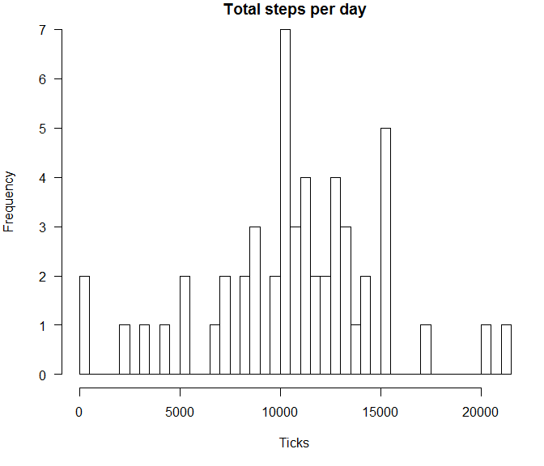
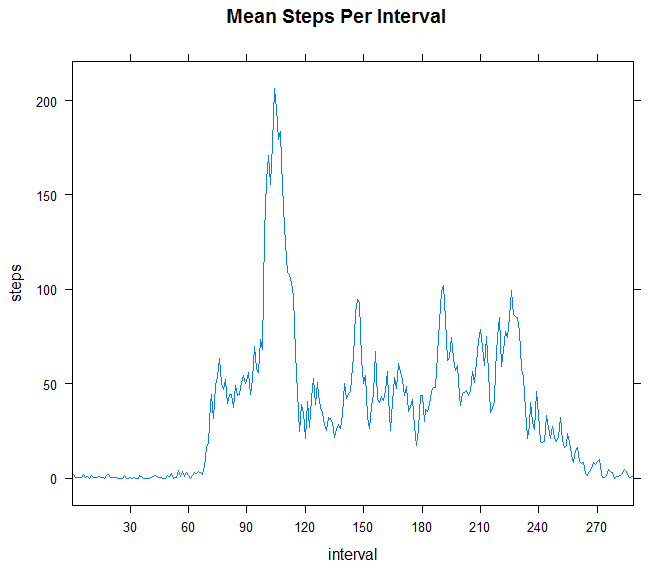
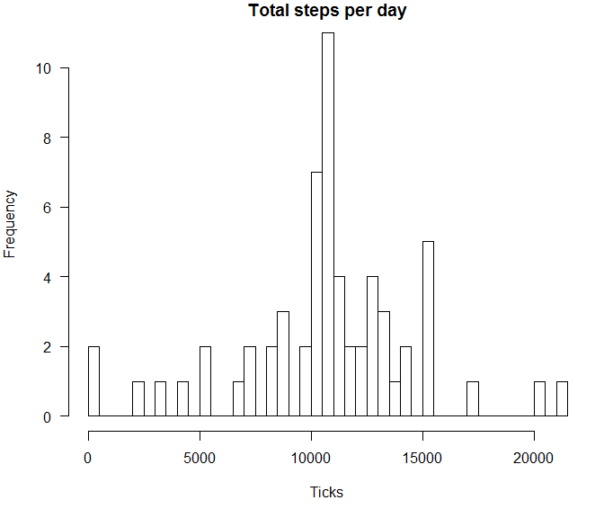
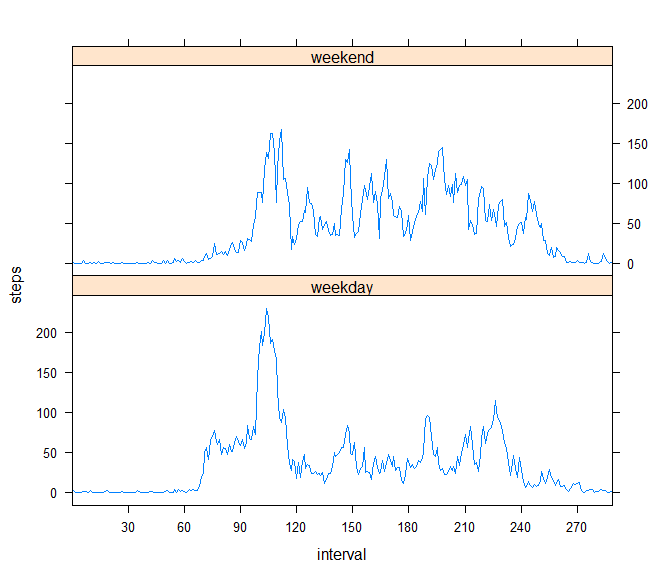

# Reproducible Research: Peer Assessment 1


## Setting up the local working environment

Set the current working directory and if the data set is not already present, download it from the course link.


```r
my.path <- "C:/Coursera/Data Science - Specialization/Reproducible Research/RepData_PeerAssessment1";
setwd(my.path);

if (file.exists("activity.csv") == F) {
        fileUrl <- "https://d396qusza40orc.cloudfront.net/repdata%2Fdata%2Factivity.zip";
        fileZip <- "./activity.zip";
        if (file.exists(fileZip) == F) {
                download.file(fileUrl, fileZip, mode = "wb")
        }
}
```


## Loading and preprocessing the data

Accomodate for reading data from the extracted csv file or directly from the zip file.


```r
if (file.exists("activity.csv") == TRUE){
        df.org <- read.csv("activity.csv")
} else{
        df.org <- read.csv(unz(fileZip,"activity.csv"))
}

# Convert the date into POSIXct
df.org$date <- as.POSIXct(df.org$date)

# Convert the interval into factor
df.org$interval <- as.factor(df.org$interval)

str(df.org)
```

```
## 'data.frame':	17568 obs. of  3 variables:
##  $ steps   : int  NA NA NA NA NA NA NA NA NA NA ...
##  $ date    : POSIXct, format: "2012-10-01" "2012-10-01" ...
##  $ interval: Factor w/ 288 levels "0","5","10","15",..: 1 2 3 4 5 6 7 8 9 10 ...
```

Using the reshape package's melt and cast functions, transform the original data set into required format to answer the questions


```r
require(reshape)
```

```
## Loading required package: reshape
```

```r
molten <- melt(df.org, id.vars=c("date", "interval"), na.rm=TRUE)
str(molten)
```

```
## 'data.frame':	15264 obs. of  4 variables:
##  $ date    : POSIXct, format: "2012-10-02" "2012-10-02" ...
##  $ interval: Factor w/ 288 levels "0","5","10","15",..: 1 2 3 4 5 6 7 8 9 10 ...
##  $ variable: Factor w/ 1 level "steps": 1 1 1 1 1 1 1 1 1 1 ...
##  $ value   : int  0 0 0 0 0 0 0 0 0 0 ...
```

Now that we have the molten data from the original data set, we can calculate the aggregate per day

```r
df.total.steps.per.day <- cast(molten, date ~ variable, sum)
```


## What is mean total number of steps taken per day?

A histogram of the total number of steps per day.

```r
par(mar = c(5,4,1,1), las=1)
hist(df.total.steps.per.day$steps, breaks=length(df.total.steps.per.day$date), main = "Total steps per day", xlab="Ticks")
```

 

We calculate the mean and median of the total number of steps tapen per day.

```r
mean.total.steps.per.day <- as.integer(mean(df.total.steps.per.day$steps))
median.total.steps.per.day <- as.integer(median(df.total.steps.per.day$steps))
```

```
Mean total number of steps per day = 10766
Median number of steps per day = 10765
```

## What is the average daily activity pattern?

Fist we cast the molten data into a new data frame which can help us answer this question

```r
steps.per.interval <- cast(molten, interval ~ variable, mean)
```

We plot a time series of the 5-minute interval (x-axis) and the average number of steps taken, averaged accross all days (y-axis)

```r
require(lattice)
```

```
## Loading required package: lattice
```

```r
xaxis.ticks <- seq(0, nrow(steps.per.interval), by = 30)
xyplot(steps ~ interval, data = steps.per.interval, main = "Mean Steps Per Interval", layout=c(1,1), type=c("l"), scales=list(x=list(at=xaxis.ticks)))
```

 

Which 5-minute interval, on average across all the days in the dataset, contains the maximum number of steps?

```r
interval.with.maxsteps <- with(steps.per.interval, interval[which(steps == max(steps))])
```

```
Interval with maximum steps = 835
```

## Imputing missing values

Create a new data frame with the missing values replaced by the mean steps per interval

```r
df.imp <- df.org
df.imp$steps <- ifelse(is.na(df.org$steps) == TRUE, steps.per.interval$steps[steps.per.interval$interval %in% df.org$interval], df.org$steps)
str(df.imp)
```

```
## 'data.frame':	17568 obs. of  3 variables:
##  $ steps   : num  1.717 0.3396 0.1321 0.1509 0.0755 ...
##  $ date    : POSIXct, format: "2012-10-01" "2012-10-01" ...
##  $ interval: Factor w/ 288 levels "0","5","10","15",..: 1 2 3 4 5 6 7 8 9 10 ...
```

Melt the new data frame

```r
molten.imp <- melt(df.imp, id=c("date", "interval"))
```

Now that we have the molten data from the imputed data set, we can calculate the aggregate per day

```r
dfimp.total.steps.per.day <- cast(molten.imp, date ~ variable, sum)
```


A histogram of the total number of steps per day.

```r
par(mar = c(5,4,1,1), las=1)
hist(dfimp.total.steps.per.day$steps, breaks=length(dfimp.total.steps.per.day$date), main = "Total steps per day", xlab="Ticks")
```

 

We calculate the mean and median of the total number of steps tapen per day.

```r
imp.mean.total.steps.per.day <- as.integer(mean(dfimp.total.steps.per.day$steps))
imp.median.total.steps.per.day <- as.integer(median(dfimp.total.steps.per.day$steps))
```

With imputed data
```
Mean total number of steps per day = 10766
Median number of steps per day = 10766
```

With Origianl data
```
Mean total number of steps per day = 10766
Median number of steps per day = 10765
```

## Are there differences in activity patterns between weekdays and weekends?

Create a new variable representing the weekday

```r
df.imp$day <- as.factor(ifelse(weekdays(df.imp$date) %in% c("Saturday", "Sunday"), "weekend", "weekday"))
#df.imp$interval <- as.factor(df.imp$interval)
```

Melt this again to cater for the new variable added.

```r
molten.new <- melt(df.imp, id=c("day", "interval"), measure=c("steps"))
weekday.cast <- cast(molten.new, day+interval~variable, mean)
```

Plot the average steps per interval for the weekend days and week days.

```r
#Create the Weekend vs Weekday plot
require(lattice)
xaxis.ticks <- seq(0, nrow(weekday.cast), by = 30)
xyplot(steps ~ interval | day, data = weekday.cast, layout=c(1,2), type=c("l"), scales=list(x=list(at=xaxis.ticks)))
```

 

